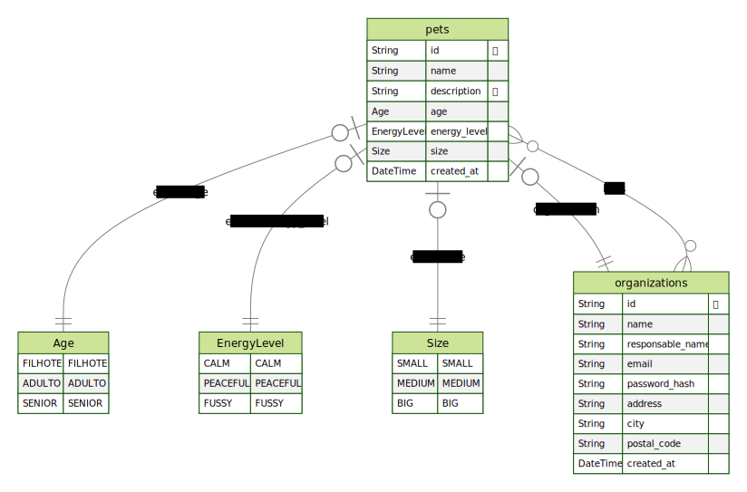

<div align="center">
  

  <br>

  <h2 align="center">
    API REST com NodeJS
  </h2>
</div>
<br>

# FIND A FRIEND API
API desenvolvida para a adoção de animais, a FindAFriend API, utilizando SOLID e testes.

## Regras da aplicação
  - [x] Deve ser possível cadastrar um pet
  - [x] Deve ser possível listar todos os pets disponíveis para adoção em uma cidade
  - [ ] Deve ser possível filtrar pets por suas características 
  - [x] Deve ser possível visualizar detalhes de um pet para adoção
  - [x] Deve ser possível se cadastrar como uma ORG
  - [x] Deve ser possível realizar login como uma ORG

## Regras de negócio
  - [x] Para listar os pets, obrigatoriamente precisamos informar a cidade
  - [x] Uma ORG precisa ter um endereço e um número de WhatsApp
  - [x] Um pet deve estar ligado a uma ORG
  - [ ] O usuário que quer adotar, entrará em contato com a ORG via WhatsApp
  - [x] Todos os filtros, além da cidade, são opcionais
  - [ ] Para uma ORG acessar a aplicação como admin, ela precisa estar logada

## Instalação
```sh
# Faça o clone do repotório
  git clone git@github.com:RenanFachin/RS_IGNITE_find-a-friend-api.git

# Instalar as dependências do projeto
  npm install

# Rodar as migrations do projeto para criar o banco de dados
  npx prisma migrate dev

# Executando o projeto no ambiente de desenvolvimento
  npm run dev
```


## Instalação do banco de dados
```sh
# Subindo o banco de dados com docker
docker compose up -d
```

## Diagrama ERD
<div align="center">
    
</div>

## Rotas
- Criar nova organização
```bash
POST /register
```

- Login na aplicação
```bash
POST /session
```

- Cadastrar um pet
```bash
POST /register/pet
```

- Buscar por um pet
```bash
GET /pet
```

## Testes automatizados
```sh
# Rodando testes unitários
npm run test

# Vendo o coverage de testes
npm run test:coverage
```
